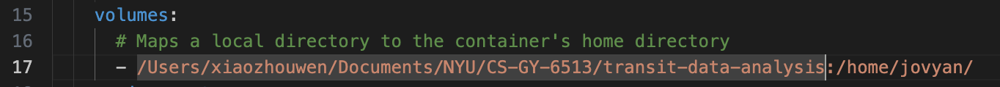
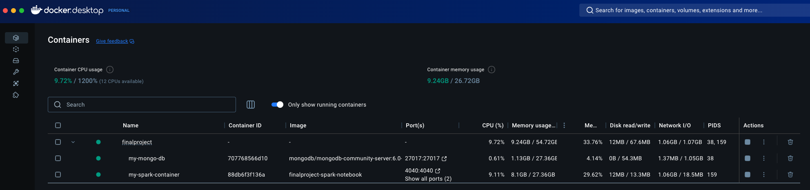
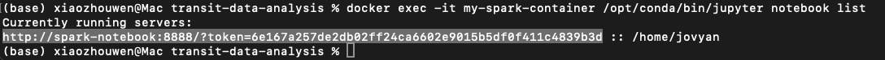
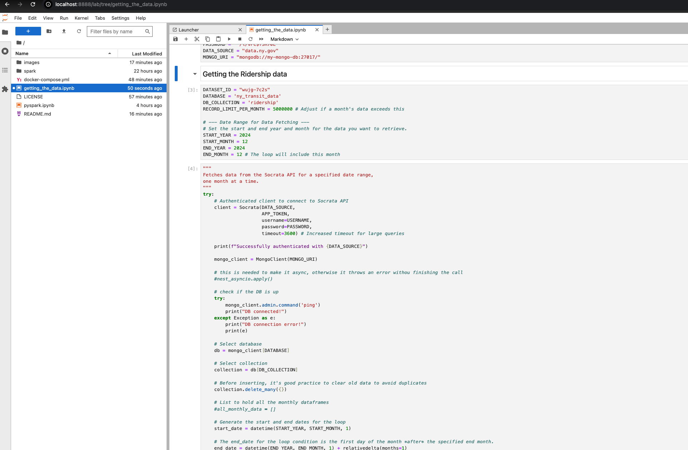

# transit-data-analysis

1. install Docker. Docker Desktop
2. modify line 17 of docker-compose.yml file  to map your local path to the jupyter notebook path
    
3. run ```docker-compose up -d``` in the terminal
    
4. run the below code to get the url to access to jupyter notebook<br>
    ```docker exec -it my-spark-container  /opt/conda/bin/jupyter notebook list```
    replace "spark-notebook" with "Localhost".<br>
    for below example, the notebook url is http://localhost:8888/?token=6e167a257de2db02ff24ca6602e9015b5df0f411c4839b3d
    
    
    
5. install [MongoDB Compass](https://www.mongodb.com/try/download/compass) to view data (optinal)<br>
connection URI mongodb://localhost:27017/


